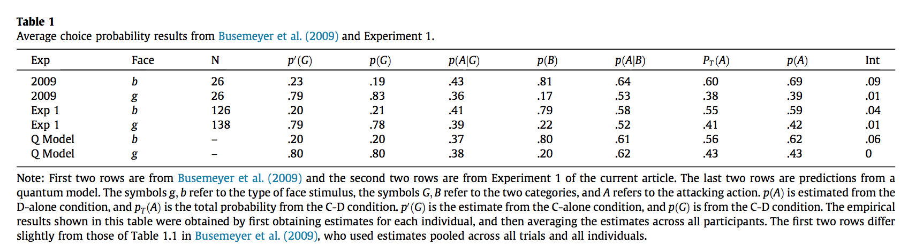
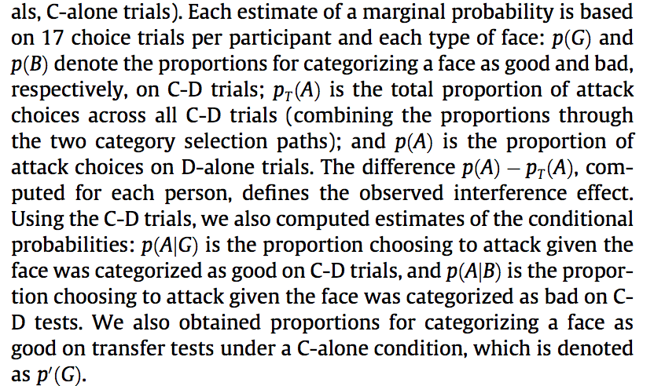
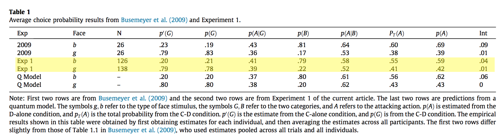

#### Article ID: UlhiU
#### Pilot: Kyle MacDonald
#### Start date: 4/4/17
#### End date: 4/10/17
#### CoPilot: Mike Frank

-------

#### Methods summary: 

In this study, Wang & Busmeyer test whether generating a category decision will interfere with subsequent decisions about actions to take. On each trial, participants saw a face and were asked to either make a categorization (good face vs. bad face) *and* an action (attack vs. withdraw) decision (C-D trials), or to only make a categorization decision (C-alone) or an action decision (D-alone). Category membership was associated probabilistically with the width of the face, and, depending on the category of the face, participants received different rewards for taking different actions (e.g., good faces had a 70% chance to be rewarded for a withdraw action and 30% for an attack action; and bad faces had a 30% chance and a 70% chance). 

The dependent variables were the mean response probabilities in the different trial types and a derived measure of "interference" computed by taking the difference between the probabilities of action decision when it was made alone versus when it was made following a categorization event: $p(A) - p(A|categorization)$. The key statistical tests were two one-sample t-tests testing the null hypothesis of no interference effect for the good faces and bad faces, and several correlations of interest.  

------

#### Target outcomes:

We will attempt to reproduce:

1. the probabilities in the second two rows of the following table (Table 1 in the paper).



2. the two, separate one-sample $t$-tests, testing the interfence effect for type $b$ faces ($t(168)=2.24$, $SE=.015$, $p=.027$) and type $g$ faces ($t(168)=.61$, $SE=.013$, $p=.54$) against a null model of no intereference effect.

3. the following correlations:
- between $p(G)$ and $p′(G)$ ($r=.52$, $p<.0001$ for type $b$ faces, $r=.65$, $p<.0001$ for type $g$ faces); 
- between $p(A)$ and $p_T(A)$ ($r=.46$, $p<.0001$ for type $b$ faces, $r=.51$, $p<.0001$ for type $g$ faces);
- between the interference effects produced by the two different types of faces ($r=-.16$, $p =.04$). 

4. the difference between $p(A|B)$ for the two types of faces

------

```{r global_options, include=FALSE}
knitr::opts_chunk$set(echo=TRUE, warning=FALSE, message=FALSE)
```

## Step 1: Load packages

```{r}
library(tidyverse) # for data munging
library(knitr) # for kable table formating
library(haven) # import and export 'SPSS', 'Stata' and 'SAS' Files
library(readxl) # import excel files
library(CODreports) # custom report functions
library(magrittr) 
library(stringr)
```

## Step 2: Load data

Here's the data description provided by Wang & Busemeyer for Experiment 1 in their codebook. 

> Data are included in the file titled “Exp1(N=169).xlsx,” and each raw summarizes a participant’s behavioral responses. The first five columns summarize responses to the “good guy” type of face (i.e., type g faces). The second five columns summarize responses to the “bad guy” type of face (i.e., type b faces). Within each five columns, the first four columns are the frequencies of response combinations in the categorization-decision (C-D) trials. The fifth column is the frequency of “withdrawing” in the decision-alone (D-alone) trials. 

Skip reading in the first row since it encodes information about face type and not the variable names. 

```{r}
d <- readxl::read_excel("data/data.xlsx", skip = 1)
```

## Step 3: Tidy data

Add a participant ID column, so we don't lose this information when we convert from wide to long format in Step 3. Each row is data for an individual participant.

```{r}
d$id <- 1:nrow(d)
```

Split the dataset using column position, so I can add the information about face type as a variable. Columns 1-5 are type g faces and columns 6-10 are type b faces. 

```{r}
# split data
d_typeg <- bind_cols(d[1:5], d['id'])
d_typeb <- bind_cols(d[6:10], d['id'])

# add the face type 
d_typeg %<>% mutate(face_type = "type_g")
d_typeb %<>% mutate(face_type = "type_b")  

# typeb is read into R with __1 appended to column names, remove this
names(d_typeb) <- str_replace(names(d_typeb), "__1", "")

# put the data frames back together in "longer" format
d_tidy <- bind_rows(d_typeb, d_typeg)
```

Add the frequency of attack responses for the D-alone trials. This information was not included in the dataset, but we know there were 17 test trials for each face type for each participant. From the results section 3.2, 

> The estimated choice probabilities (i.e., sample proportions) were obtained for each participant and each type of face from the last block of C-D trials and from the transfer tests (D-alone trials, C-alone trials). Each estimate of a marginal probability is based on 17 choice trials per participant and each type of face: (p. 137)

So to get the frequency of attack responses, subtract the frequency of withdrawing responses from 17. 

```{r}
n_test_trials_per_face <- 17

d_tidy %<>% 
  mutate(`Attack (D-alone)` = n_test_trials_per_face - `Friendly (D-alone)`)
```

Convert from wide format to long format using the `tidyr::gather` function.

```{r}
d_tidy_l <- d_tidy %>% 
  gather(key = trial_info, 
         value = freq_response, 
         `Good&Friendly`:`Friendly (D-alone)`, `Attack (D-alone)`) 
```

Add information about C-D vs. D-alone trials. This is also specified by column position in the original data: 1-4 and 6-9 are C-D trials; 5 and 10 are D-alone trials. I am going to take advantage of the fact that the character `&` only occurs in the C-D variable names

```{r}
d_tidy_l %<>% 
  mutate(trial_type = ifelse(str_detect(trial_info, 
                                        pattern = "&"), 
                             "C-D", "D-alone"))
```

Clean up the trial name variable to remove spaces and special characters.

```{r}
d_tidy_l %<>% 
  mutate(trial_info = gsub(.$trial_info, 
                           pattern = "&", 
                           replacement = "_")) %>% 
  mutate(trial_info = gsub(.$trial_info, 
                           pattern = " \\(D-alone\\)", 
                           replacement = ""))
```

Separate the information in the `trial_info` variable since this contains information about both the categorization (good or bad guy) and the decision to attack or withdraw.

```{r}
d_tidy_l %<>% 
  separate(col = trial_info, 
           sep = "_", 
           into = c("cat_decision", "attack_decision"),
           fill = "left") 
```

Change one of the levels of the attack decision variable from "Friendly" to "Withdraw" to be more consistent with the terminology used in the paper text. I clean up the category decision variable to be "none" for the D-alone trials where participants did not make a categorization response prior to an attack/withdraw decision. 

```{r}
d_tidy_l %<>% 
  mutate(attack_decision = ifelse(attack_decision == "Friendly", 
                                  "Withdraw", attack_decision),
         cat_decision = ifelse(is.na(cat_decision), 
                               "none", cat_decision))
```

### Some tests to check our wrangling 

Test to make sure we still have 169 unique participants after data munging.

```{r}
n_tidy <- d_tidy_l %>% 
  distinct(id) %>% 
  nrow()

n_tidy == nrow(d)
```

How many responses do we have for each participant? We don't have data for the C-alone trials, so my best guess is that we should expect 68 total responses for each participant (2 face types X 2 blocks X 17 trials in each block). 

```{r}
resp_check <- d_tidy_l %>% 
  group_by(id) %>% 
  summarise(n_resp = sum(freq_response)) %>% 
  .$n_resp == 68 

sum(resp_check) == 169
```

Each participant has 68 total responses. Thus, we now have tidy data in long format with the correct number of participants and trials. 

Are all participantse represented in the data? From Wang & Busmeyer, 

> Some participants, whom we call "optimizers," always chose the "optimal" category for a particular type of face on C-D trials: 43 did so for the narrow faces and 31 did so for the wide faces (approximately 25% and 18%, respectively, of the 169 participants). These participants obey the law of total probability for either type of face for trivial reasons, and for these participants, we cannot estimate the conditional probabilities for non-chosen categories and thus cannot really estimate the total probability for an action decision. (p. 137)

But we believe it will not be possible to reproduce this filtering criterion given the reported data. We do not have data tabulated for wide/narrow faces, only for good and bad faces (which is only probabilistically related to the face type). 

Nevertheless, considering the `N` column in Table 1 reveals a coincidence, namely that $N_bad = 126 = 169 - 43$ and $N_good = 138 = 169 - 31$. It is unclear to us how this filtering procedure was done, because these $N$s should only match if "narrow face optimizers" were removed for "bad guy" trials, and the text reports that

> Participants were randomly assigned to one of the associations between face features and types of faces: (1) the narrow faces with thick lips were more likely to be bad guys (the type b faces) or (2) they were more likely to be good guys (the type g faces). (p. 137)

In any case, in the text, it's stated that:

> The statistical tests were computed using all 169 participants. (p. 138)

In any case, we move forward with the full, unfiltered dataset. 

```{r}
d_analysis <- d_tidy_l
```

## Step 4: Run analysis

Some text about how to compute the marginal probabilties: 



There was also some important information about the computation in the caption of Table 3: 

> The empirical results shown in this table were obtained by first obtaining estimates for each individual, and then averaging the estimates across all participants.


### Descriptive statistics

Store some global variables common across all marginal probabilites 

```{r}
n_ss <- 169
n_cd_trials <- 34
n_d_alone_trials <- 34
n_trials_per_face_type <- n_cd_trials / 2
```

INSUFFICIENT INFORMATION ERROR

We can't reproduce $p'(G)$ or $p'(B)$, which is the probability of categorizing a face as good or bad on the categorization only trials (C-alone) because they did not provide these data.

Get $p(G)$ and $p(B)$, which is equal to the probability of categorizing a face as good or bad on C-D trials.

```{r}
ss_pg_pb <- d_analysis %>% 
  filter(trial_type == "C-D") %>% 
  group_by(id, face_type, cat_decision) %>% 
  summarise(freq = sum(freq_response),
            p_ss = freq / n_trials_per_face_type) 

ms_p_g_b <- ss_pg_pb %>% 
  group_by(face_type, cat_decision) %>% 
  summarise(p = mean(p_ss)) %>% 
  mutate_if(is.numeric, round, digits = 2) 

ms_p_g_b %<>% 
  spread(key = cat_decision, value = p) %>% 
  rename(p_b = Bad, p_g = Good)
```

Next, let's try to reproduce the conditional probability $p(A|G)$ or the probability that the participants attacked given categorizing a face as good.

```{r}
ss_p_ag <- d_analysis %>% 
  filter(trial_type == "C-D", cat_decision == "Good") %>%
  group_by(id, face_type) %>% 
  mutate(n_trials = sum(freq_response),
         p_ss = ifelse(n_trials == 0, 0, freq_response / n_trials)) %>% # deal with the divide by zero 
  filter(attack_decision == "Attack")

ms_p_ag <- ss_p_ag %>% 
  group_by(face_type, attack_decision) %>% 
  summarise(p_a_given_g = mean(p_ss)) %>% 
  mutate_if(is.numeric, round, digits = 2) %>% 
  filter(attack_decision == "Attack") %>% 
  select(face_type, p_a_given_g)
```

Now, $p(A|B)$ or the probability that the participants attacked given categorizing a face as bad.

```{r}
ss_p_ab <- d_analysis %>% 
  filter(trial_type == "C-D", cat_decision == "Bad") %>%
  group_by(id, face_type) %>% 
  mutate(n_trials = sum(freq_response),
         p_ss = ifelse(n_trials == 0, 0, freq_response / n_trials)) %>% # deal with the divide by zero 
  filter(attack_decision == "Attack")

ms_p_ab <- ss_p_ab %>% 
  group_by(face_type, attack_decision) %>% 
  summarise(p_a_given_b = mean(p_ss)) %>% 
  mutate_if(is.numeric, round, digits = 2) %>% 
  filter(attack_decision == "Attack") %>% 
  select(face_type, p_a_given_b)
```

$p(A)$ or the proportion of attack choices on D-alone trials.

```{r}
ss_p_a <- d_analysis %>% 
  filter(trial_type == "D-alone", attack_decision == "Attack") %>% 
  group_by(id, face_type) %>% 
  mutate(freq_attack = sum(freq_response),
         p_attack_ss = freq_attack / n_trials_per_face_type)

ms_p_a <- ss_p_a %>% 
  group_by(face_type) %>% 
  summarise(p_attack = mean(p_attack_ss)) %>% 
  mutate_if(is.numeric, round, digits = 2) 
```

$p_t(A)$ is the total proportion of attack choices across all C-D trials (combining the proportions through the two category selection paths)

```{r}
ss_pt_a <- d_analysis %>% 
  filter(trial_type == "C-D", attack_decision == "Attack") %>% 
  group_by(id, face_type) %>% 
  mutate(freq_attack = sum(freq_response),
         pt_attack_ss = freq_attack / n_trials_per_face_type) %>% 
  select(id, face_type, pt_attack_ss) %>% 
  distinct(.keep_all = T)

ms_pt_a <- ss_pt_a %>%   
  group_by(face_type) %>% 
  summarise(pt_attack = mean(pt_attack_ss)) %>% 
  mutate_if(is.numeric, round, digits = 2) 
```

The interference effect, or the difference between attack decisions with and without a categorization decision: $interference = p(A) - p_t(A)$

```{r}
ss_int <- ss_pt_a %>% 
  select(id, pt_attack_ss, face_type) %>% 
  left_join(., select(ss_p_a, id, p_attack_ss, face_type)) %>% 
  distinct(., .keep_all = T) %>% 
  mutate(int_effect_ss = p_attack_ss - pt_attack_ss)

ms_int <- ss_int %>% 
  group_by(face_type) %>% 
  summarise(int = mean(int_effect_ss)) %>% 
  mutate_if(is.numeric, round, digits = 2) 
```

Try to reproduce the key rows of Table 1:



```{r}
ms_p_g_b %>% 
  mutate(n = NA,p_prime_g = NA) %>%
  left_join(., ms_p_ag) %>% 
  left_join(., ms_p_ab) %>% 
  left_join(., ms_p_a) %>% 
  left_join(., ms_pt_a) %>% 
  left_join(., ms_int) %>% 
  select(face_type, n, p_prime_g, p_g, p_a_given_g, p_b, p_a_given_b, pt_attack, p_attack, int) %>%
  kable(digits = 2)
```

INSUFFICIENT INFORMATION ERROR

It's clear from the `N` column that the descriptive statistics reflect filtered data of some sort (e.g., 169 - 43 = 126), hence we can't reproduce these numbers (see above).  

### Inferential statistics

First, the two, separate one-sample t-tests, testing the interfence effect for type $b$ faces ($t(168)=2.24$, $SE=.015$, $p=.027$) and type $g$ faces ($t(168)=.61$, $SE=.013$, $p=.54$) against a null model of no interference effect.

```{r}
b_t_test <- ss_int %>% 
  filter(face_type == "type_b") %>% 
  .$int_effect_ss %>% 
  t.test(., mu = 0)
b_t_test
```

```{r}
compareValues(reportedValue = .027, obtainedValue = b_t_test$p.value)
```


```{r}
g_t_test <- ss_int %>% 
  filter(face_type == "type_g") %>% 
  .$int_effect_ss %>% 
  t.test(., mu = 0)

g_t_test
```

```{r}
compareValues(reportedValue = .54, obtainedValue = g_t_test$p.value)
```

INSUFFICIENT INFORMATION ERROR

We can't compute the correlations between $p(G)$ and $p′(G)$ ($r=.52$, $p<.0001$) or for type $b$ faces, $r=.65$, $p<.0001$ for type $g$ faces) because calculating $p′(G)$ requires the C-alone data, which we don't have.

Correlation between $p(A)$ and $p_T(A)$ for type $b$ faces ($r=.46$, $p<.0001$);

```{r}
# NB - this code relies on the descriptives being done without filtering, as is currently the case. 

p_a_b <- ss_p_a %>% filter(face_type == "type_b") %>% .$p_attack_ss
pt_a_b <- ss_pt_a  %>% filter(face_type == "type_b") %>% .$pt_attack_ss
cor_pa_pta_b <- cor.test(p_a_b, pt_a_b)
cor_pa_pta_b
```

```{r}
compareValues(reportedValue = .46, obtainedValue = cor_pa_pta_b$estimate)
```

Correlation between $p(A)$ and $p_T(A)$ for type $g$ faces ($r=.51$, $p<.0001$ for type $g$ faces). 

```{r}
p_a_g <- ss_p_a %>% filter(face_type == "type_g") %>% .$p_attack_ss
pt_a_g <- ss_pt_a  %>% filter(face_type == "type_g") %>% .$pt_attack_ss
cor_pa_pta_g <- cor.test(p_a_g, pt_a_g)
cor_pa_pta_g
```


```{r}
compareValues(reportedValue = .51, obtainedValue = cor_pa_pta_g$estimate)
```

Correlation between the interference effects produced by the two different types of faces ($r=-.16$, $p=.04$). 

```{r}
int_type_b <- ss_int %>% filter(face_type == "type_b") %>% .$int_effect_ss
int_type_g <- ss_int %>% filter(face_type == "type_g") %>% .$int_effect_ss
cor_int <- cor.test(int_type_b, int_type_g)
cor_int
```


```{r}
compareValues(reportedValue = -.16, obtainedValue = cor_int$estimate)
```
## Step 5: Conclusion

```{r}
codReport(Report_Type = 'joint',
          Article_ID = 'UlhiU', 
          Insufficient_Information_Errors = 2,
          Decision_Errors = 0, 
          Major_Numerical_Errors = 0, 
          Minor_Numerical_Errors = 1, 
          Author_Assistance = FALSE)
```

In summary, the outcome of this report is a failure since I was not able to reproduce the probabilities in Table 2. The two main issues were: (1) as far as I could tell, the authors did not include the C-alone trials in the published data and (2) I was not able to reproduce the number of participants removed for the two face types using their filtering criterion (and these participants were not flagged in their data file). However, it's possible that I was not implementing the criterion correctly. In contrast to the descriptive statistics, I was able to reproduce the key inferential statistics from the paper. 

There were also several important pieces of information that were not clearly described in the results section: (1) information about needing to compute probabilities for each participant before averaging across participants was located in the caption of Table 3 and (2) information about the "optimizer" filtering criterion was in the model description section of the introduction (2.2.1. Optimal model). 

```{r session_info, include=TRUE, echo=TRUE, results='markup'}
devtools::session_info()
```

