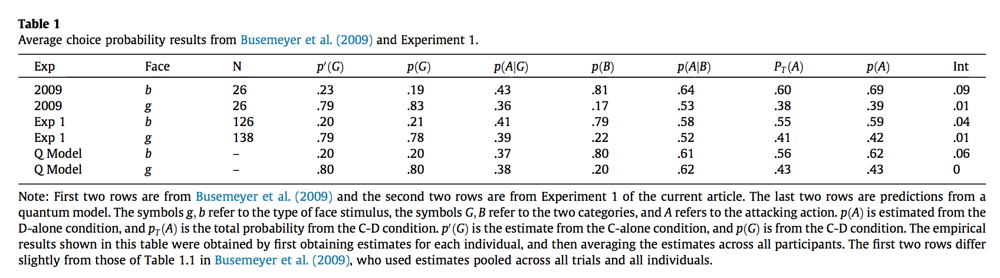

#### Article ID: UlhiU
#### Pilot: Kyle MacDonald
#### Co-pilot: Tom Hardwicke  
#### Start date: 4/4/17
#### End date: [Insert end date - use US format]   

-------

#### Methods summary: 
[Write a brief summary of the methods underlying the target outcomes written in your own words]

------

#### Target outcomes:

We will attempt to reproduce:

  1.the values in the second two rows of the following table (Table 1 in the paper) .
  


  2. the two, separate one-sample t-tests, testing the interfence effect for type b faces (t(168)=2.24,SE=.015,p=.027) and type g faces (t(168)=.61,SE=.013,p=.54) against a null model of no intereference effect.
  
  3. the following correlations:
    - between p(G) and p′(G) (r=.52,p<.0001 for type b faces, r=.65,p<.0001 for type g faces); 
    - between p(A) and pT(A) (r=.46,p<.0001 for type b faces, r=.51,p<.0001 for type g faces). 
    - between the interference effects produced by the two different types of faces (r=-.16,p=.04). 
    
  4. the difference between p(A|B) for the two types of faces


------

```{r global_options, include=FALSE}
knitr::opts_chunk$set(echo=TRUE, warning=FALSE, message=FALSE)
```

## Step 1: Load packages

```{r}
library(tidyverse) # for data munging
library(knitr) # for kable table formating
library(haven) # import and export 'SPSS', 'Stata' and 'SAS' Files
library(readxl) # import excel files
library(CODreports) # custom report functions
library(magrittr)
library(stringr)
```

## Step 2: Load data

Here is the data description provided by Wang & Busemeyer for Experiment 1. 

> Data are included in the file titled “Exp1(N=169).xlsx,” and each raw summarizes a participant’s behavioral responses. The first five columns summarize responses to the “good guy” type of face (i.e., type g faces). The second five columns summarize responses to the “bad guy” type of face (i.e., type b faces). Within each five columns, the first four columns are the frequencies of response combinations in the categorization-decision (C-D) trials. The fifth column is the frequency of “withdrawing” in the decision-alone (D-alone) trials. 

First, I am going to skip reading in the first row since it encodes information about face type and not the variable names. 

```{r}
d <- readxl::read_excel("data/data.xlsx", skip = 1)
```

## Step 3: Tidy data

Here I am adding a participant ID column, so we do not lose this information when we convert from wide to long format in Step 3. This is straightforward since each row is data for an indvidual participant.

```{r}
d$id <- 1:nrow(d)
```

Next, I use the column position to split the dataset, so I can add the information about face type as a variable. Note that columns 1-5 are type g faces and columns 6-10 are type b faces. 

```{r}
# split data
d.typeg <- bind_cols(d[1:5], d['id'])
d.typeb <- bind_cols(d[6:10], d['id'])

# add the face type 
d.typeg %<>% mutate(face_type = "type_g")
d.typeb %<>% mutate(face_type = "type_b")  

# put the data frames back together in "longer" format
d.tidy <- bind_rows(d.typeb, d.typeg)
```

Next, we convert from wide format to long format using the gather() function.

```{r}
d.tidy.long <- d.tidy %>% 
  gather(key = trial_name, value = freq_response, `Good&Friendly`:`Friendly (D-alone)`) 
```

Now we add information about C-D vs. D-alone trials. This is also specified by column position in the original data: 1-4 and 6-9 are C-D trials; 5 and 10 are D-alone trials. I am going to take advantage of the fact that the character "&" only occurs in the C-D variable names

```{r}
d.tidy.long %<>% mutate(trial_type = ifelse(str_detect(trial_name, pattern = "&"), 
                                            "C-D", "D-alone"))
```

Finally, I am going to clean up the trial name variable to remove spaces and special characters.

```{r}
d.tidy.long %<>% 
  mutate(trial_name = gsub(.$trial_name, pattern = "&", replacement = "_")) %>% 
  mutate(trial_name = gsub(.$trial_name, pattern = " \\(D-alone\\)", replacement = ""))
```

Test to make sure we still have 169 unique participants after data munging.

```{r}
n.tidy <- d.tidy.long %>% 
  distinct(id) %>% 
  nrow()

n.tidy == nrow(d)
```

Great, we now have tidy data in long format.

Now we need to remove the "optimizers" from the data set. From Wang & Busmeyer, 

> Some participants, whom we call "optimizers," always chose the "optimal" category for a particularly type of face on C-D trials: 43 did so for the narrow faces and 31 did so for the wide faces (approximately 25% and 18%, respectively, of the 169 participants). These participants obey the law of total probability for either type of face for trivial reasons, and for these participants, we cannot estimate the conditional probabilities for non-chosen categories and thus cannot really estimate the total probability for an action decision.

KM note: It would have been really helpful if Wang & Busmeyer had flagged these participants in the data. 

```{r}
d.tidy.long %>% 
  group_by(id, trial_type, face_type) %>% 
  summarise(count = n())

```


## Step 4: Run analysis

### Descriptive statistics

```{r}
d.tidy.long %>% 
  group_by()
```

### Inferential statistics

```{r}
```

## Step 5: Conclusion

```{r}
```

[Please also include a brief text summary describing your findings. If this reproducibility check was a failure, you should note any suggestions as to what you think the likely cause(s) might be.]

[This function will output information about the package versions used in this report:]

```{r session_info, include=TRUE, echo=TRUE, results='markup'}
devtools::session_info()
```
